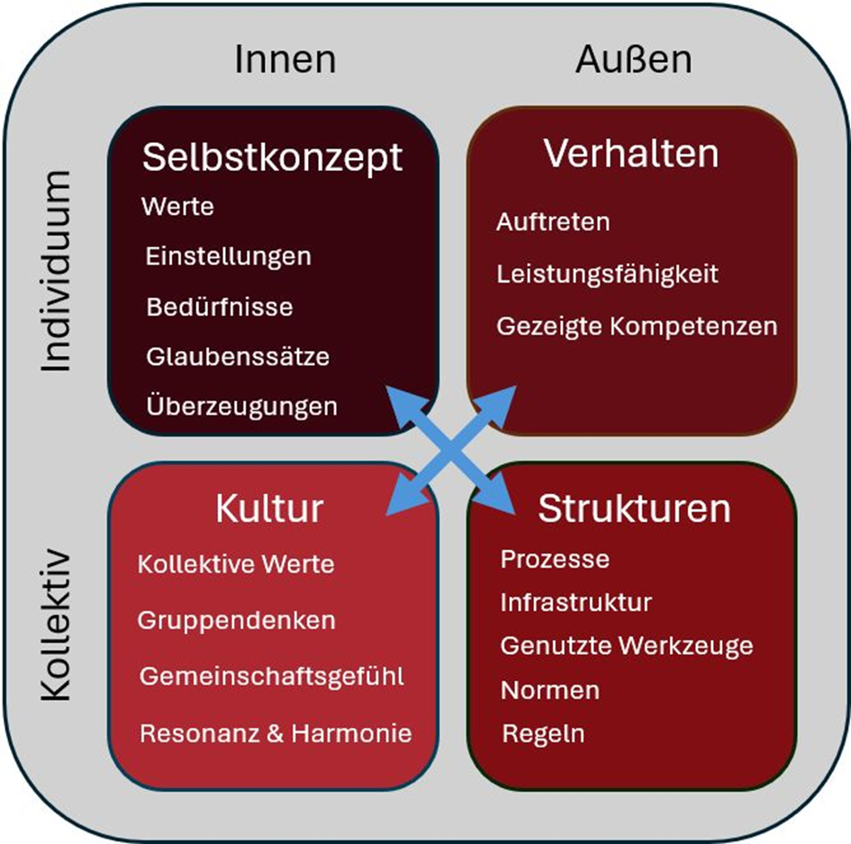

Salut ihr Lieben! Nachdem ich mich letzte Woche über die Verschwurbelung von "Agilität" ausgelassen habe, möchte ich heute ins Change Management einsteigen.  
  
Es gibt hier ja häufig zwei (dem Anschein nach 🙄) gegensätzliche Seiten, in Bezug auf die Herleitung der aktuellen Situation und möglicher Maßnahmen:  
  
Die "Mensch & Mindset" Fraktion, die alles im Menschen 🤷‍♂️ verortet und die "System" Fraktion, die mir zu häufig alles nur im Außen 🏢 verortet (und dabei häufig verkennt, dass Menschen ja selbst Systeme sind 🤭).  
  
Denkt man also wirklich systemisch (d.h. den Menschen mit): Alles super. Ist dann auch nicht so übergriffig, wie die Versuche, irgendwem etwas anzuerziehen.  
  
Jetzt aber der Kicker: Wer ist denn in der Lage, Strukturen zu verändern? In der Regel ja Menschen mit formaler Macht. Da ist das Denken und Fühlen als Ausgangspunkt für's Handeln schon sehr (ge)wichtig.  
  
Und hier kommt der integrale Ansatz nach Ken Wilber ins Spiel: Die vier Quadranten (s. Schaubild) hängen voneinander ab und beeinflussen sich gegenseitig. Das heißt, dass man als professionelle:r Change Manager:in die Wechselwirkungen im Kopf haben sollte, um wirklich wirksam werden und unerwünschte Nebenwirkungen zumindest antizipieren zu können.  
  
⁉ Kennt ihr das Modell bereits? Und so oder so: Geht ihr da mit?  

