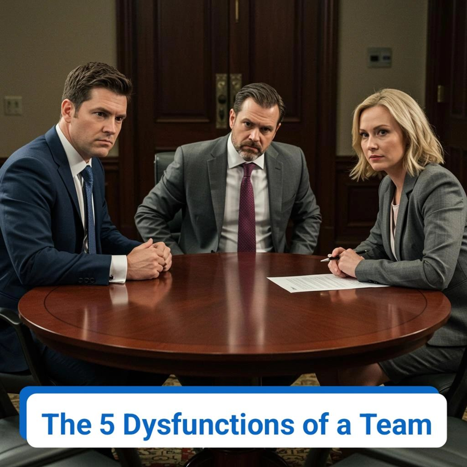

"Not finance. Not strategy. Not technology. It is teamwork that remains the ultimate competitive advantage, both because it is so powerful and so rare."  
Patrick Lencioni, 5 Dysfunctions of a Team.  
  
Immer wieder bin ich erstaunt, wie selten sich Management-"Teams" als Team begreifen. Obwohl sie im selben Boot sitzen, arbeiten sie häufig gegen- statt miteinander. 🔫  
  
Und dann zeigen sich nicht selten genau jene Muster, die Patrick Lencioni in seinem Klassiker beschreibt:  
  
🚩 Mangelndes Vertrauen:  
 Fehlende Offenheit und Transparenz, wodurch wichtige Themen unausgesprochen bleiben.  
  
🚩 Furcht vor Konflikten:  
 Diskussionen werden vermieden, was zu Stillstand und (zunächst..) unausgetragenen Differenzen führt.  
  
🚩 Fehlendes Commitment:  
 Unklare Entscheidungen und fehlende Unterstützung hinter vereinbarten Zielen.  
  
🚩 Vermeidung von Verantwortung:  
 Aufgaben werden hin- und hergeschoben statt aktiv gelöst. Entscheidungen werden nicht getroffen.  
  
🚩 Fehlende Aufmerksamkeit gegenüber Ergebnissen:  
 Der Fokus liegt auf persönlichen Interessen statt auf gemeinsamen Zielen.  
  
Leider begünstigen gängige Management-Systeme häufig genau jene Ausprägung. Einzelkämpfer:innen, die für den persönlichen Erfolg kämpfen, sind leider oft erfolgreicher, auch wenn es die Organisation dadurch vor allem langfristig nicht ist. 📉  
  
Ganz im Gegenteil: Aus Differenzen in der Führung kaskadieren genau die oben genannten Punkte durch die Organisation – im Extremfall bis zur völligen Auflösung der Wertschöpfung. ❌️  
  
Entsprechend schwierig ist es auch, solche systemischen Muster zu durchbrechen. Hat sich solch ein System etabliert, ist auch der Austausch einer einzigen Person nicht ausreichend. Selbst eine neu eingesetzte Person mit besten Absichten und Kompetenzen spielt dann entweder mit – oder verlässt dieses Spielfeld wieder. 🎲  
  
Deshalb braucht es hier aktive Intervention. Und vor allem die Macht, das System "von außen", als Instanz, zu ändern.  
Das macht eine:n wirklich gute:n CEO aus meiner Sicht aus. Sie oder er schafft es, nicht im, sondern am System zu arbeiten. Und (mit dem Team!) den strategischen und strukturellen Rahmen zu setzen, der die gemeinsame Arbeit an gemeinsamen Zielen belohnt. 🏋  
  
Aber auch da: Die ambitionierteste und kompetenteste Person kann hier nichts tun, wenn die Entscheidungsfreiheit, etwa vom Aufsichtsrat, zu stark eingeschränkt wird. Da braucht es die unternehmerische Freiheit und Durchsetzungsstärke, auch zunächst unbequeme Entscheidungen zu treffen, die sich unter Umständen erst mit der Zeit manifestieren. So besteht aber die Chance, dass sich die 5 Dysfunktionen mit der Zeit auflösen oder weitestgehend verhindern lassen. 📈  
  
⁉️ Wie ist eure Meinung dazu? Macht ihr solche Beobachtungen ebenfalls? Falls ja, was sind die Ursachen aus eurer Sicht?

