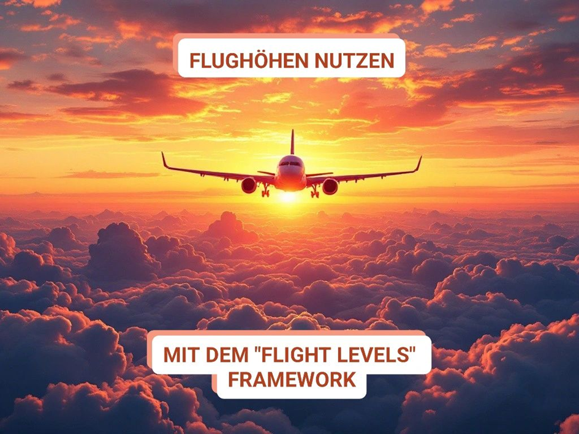

Die meisten agilen Transformationen enden als brennendes Wrack. 🔥  
Deshalb ist es wichtig, die Flight Levels im Auge zu behalten... ✈️  
  
Wer mich kennt, weiß: Ich bin kein Freund der meisten gängigen Frameworks: Zu eng, zu starr, zu kompliziert. Was bringt mir ein Framework, das keiner versteht (Hallo, SAFe!) oder sich nicht mit meiner unternehmerischen Realität vereinbaren lässt? Das sich lediglich auf Team-Effizienz fokussiert und damit gilt "Lokale Optimierung = keine Optimierung", wenn das Bottleneck ganz wo anders sitzt? 🍾  
  
Deshalb schätze ich das "Flight Levels" Modell von [Klaus Leopold](https://www.linkedin.com/in/klausleopold/).  
Dabei wird der Blick geweitet und gleichzeitig Struktur gegeben. Auf drei Ebenen der Organisation, die für sich selbst gut aufgestellt sein und sinnvoll ineinandergreifen müssen:  
  
Strategie (Flight Level 3):  
"Richtige" Strategiearbeit muss hier passieren, da sich alle weiteren Ebenen daran ausrichten:  
Wo wollen wir mit unserem Produktportfolio in drei Jahren stehen?  
Was können wir leisten, wie wollen wir den Markt bedienen?  
  
Portfoliomanagement (Flight Level 2):  
Spiegelung der laufenden und geplanten Initiativen auf die Strategie. Hier merkt man schnell: Vieles ist oft reiner Aktionismus. Daher: Schlanke Governance (etwa durch regelmäßige Portfolio-Syncs), um die Ressourcen zielgerichtet einzusetzen. Weglassen von Dingen, die null zum Strategieziel beitragen.  
  
Operative Umsetzung (Flight Level 1):  
Hier kommen die operativen Teams ins Spiel. Wird hier das "Work in Progress" limitiert und dafür gesorgt, dass regelmäßig der Connect zur Portfolio-Ebene gecheckt wird, ist man auf einem guten Weg: Läuft das Projekt noch konform zur übergeordneten Vision?  
Der Vorteil: Die Teams spüren, dass ihr Input wirklich zählt, weil sie Teil eines durchgängigen und nachvollziehbaren (statt erratischen!) Systems sind - das steigert die Motivation enorm.  
  
Man erkennt:  
\- Es gibt keinen Bruch zwischen Strategie, Koordination und Umsetzung. Ordentlich aufgesetzte Kommunikations- und Steuerungssysteme horizontal und vertikal sorgen dafür, dass die Strategie auch umgesetzt wird. Das passiert tatsächlich selten.  
  
\- Es lassen sich weitere unterstützende Hilfsmittel integrieren, wo es sinnvoll ist. Etwa ein transparentes Kanban auf allen Ebenen, OKRs oder Scrum auf Teamebene. Funktioniert alles wunderbar, solange der Nutzen klar ist.  
  
  
💡Was lernt man daraus?  
  
Wer glaubt, Agilität auf die Team-Ebene zu beschränken, wird niemals die ganze Organisation in Bewegung bringen. Große Frameworks mögen zwar gut klingen, doch sie lassen oft Strategie- und Portfoliothemen außen vor oder erschlagen mit Bürokratie.  
  
Flight Levels sind für mich der Mittelweg: Fokussiert, pragmatisch und trotzdem ganzheitlich.  
Ich setze dieses Konzept seit Jahren ein, um Business Agility wirklich zu verankern - ohne starre Methoden-Korsetts, sondern mit Raum für individuelle Prozessgestaltung.  
  
💬 Was ist eure Erfahrung?  
Nutzt ihr Flight Levels bereits? Vielleicht sogar ohne das Framework zu kennen?

