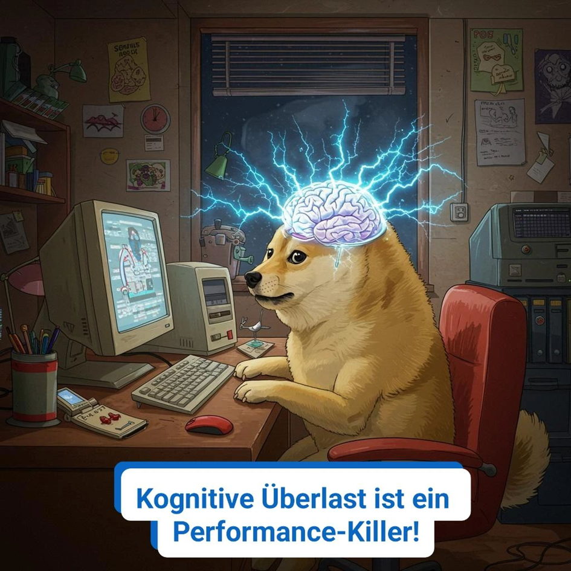

"DOGE arbeitet 120 Stunden pro Woche. Unsere bürokratischen Gegner arbeiten optimistisch 40 Stunden pro Woche. Deshalb verlieren sie so schnell."  
\- Elon Musk  
  
"Bullshit." - Magnus Maus  
  
In vielen Branchen oder Rollen gehört es zum guten Ton, \*weit\* mehr als 40 Stunden pro Woche zu arbeiten. Im Hedge-Fonds Management, in der Beratung, oder im Investmentbanking. Aber auch im "klassischen" Management jeder Couleur: Wer was auf sich hält, muss was leisten. Und das heißt Stunden abreißen.  
  
Aber ist es so einfach? Wer sich in der Praxis mal angeschaut hat (oder gar aufräumen muss), was da bei 80 Stunden/Woche an Ergebnissen rauskommt, merkt schnell, die negativen Punkte dominieren. Es ist also oft einfach 🌟Leistungstheater🌟 🎭.  
  
Ihr kennt es ja selbst: Abends noch Stunde um Stunde drangehängt, um fertig zu werden. Nur um mit frischem Kopf am nächsten Tag zu merken, was man da für einen Quatsch produziert hat. Also ab in die Revision, die jetzt aber schnell vonstatten geht. Also de facto verschenkte Zeit.  
  
Doch warum ist das so? Ein Ausflug in die Biopsychologie 🧠:  
  
Glutamat ist ein Neurotransmitter, der sich bei (v.a. gesteigerter) Hirnaktivität im Gehirn ansammelt.  
Bei höherer Konzentration wirkt er neurotoxisch. ☠️  
  
Wenn dir nach einem langen Tag das Denken schwerfällt und die Region hinter der Stirn schmerzt, dann ist das ein Zeichen dafür, dass du dich dringend erholen solltest. 🛑  
Am besten mit Schlaf, denn im Tiefschlaf bauen wir die Toxine ab. 🛌  
Tust du das nicht, kann das langfristig deine Nervenzellen schädigen.❗️  
  
Es gibt Theorien, dass das Hirn über einen Schutzschalter verfügt: Läuft es in Gefahr, geschädigt zu werden, werden scheinbar bewusste Entscheidungen umgeroutet: Wir durchdenken sie nicht mehr richtig. Unser Hirn trickst uns aus. Das führt zu schnelleren, aber potenziell unsinnigen Entscheidungen. Und da gerade häufig Personen mit viel Verantwortung viele Stunden abreißen, ist das umso gefährlicher.  
  
Daher: Weniger ist hier wirklich mehr, auch wenn einige Superperformer uns etwas anderes erzählen wollen. Output != Outcome.  
  
Übrigens: Die notwendige Erholung bei Erschöpfung steigt exponentiell. 📈  
D.h. macht lieber regelmäßige Pausen. Dadurch arbeitet ihr nicht nur produktiver, sondern könnt auch unterm Strich \*mehr\* arbeiten, weil ihr früher wieder fit seid.  
  
💬 Wusstet ihr das? Oder kennt ihr Glutamat nur als Geschmacksverstärker? Ich bin gespannt..

