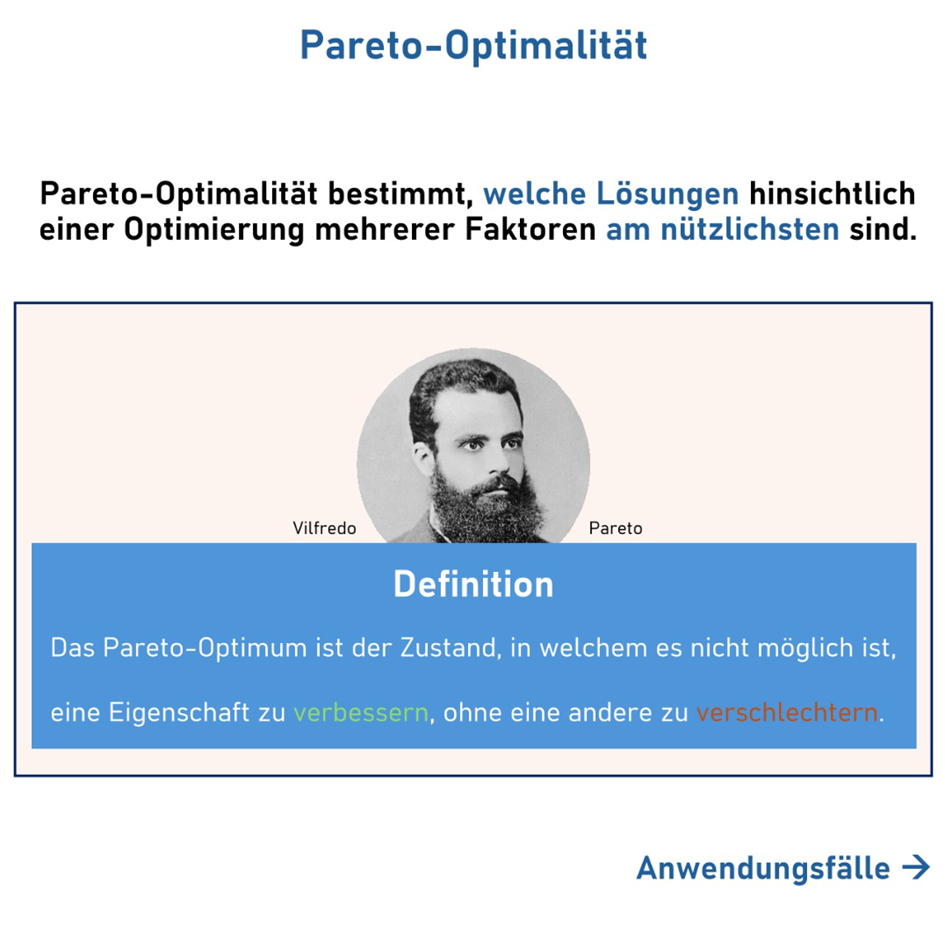
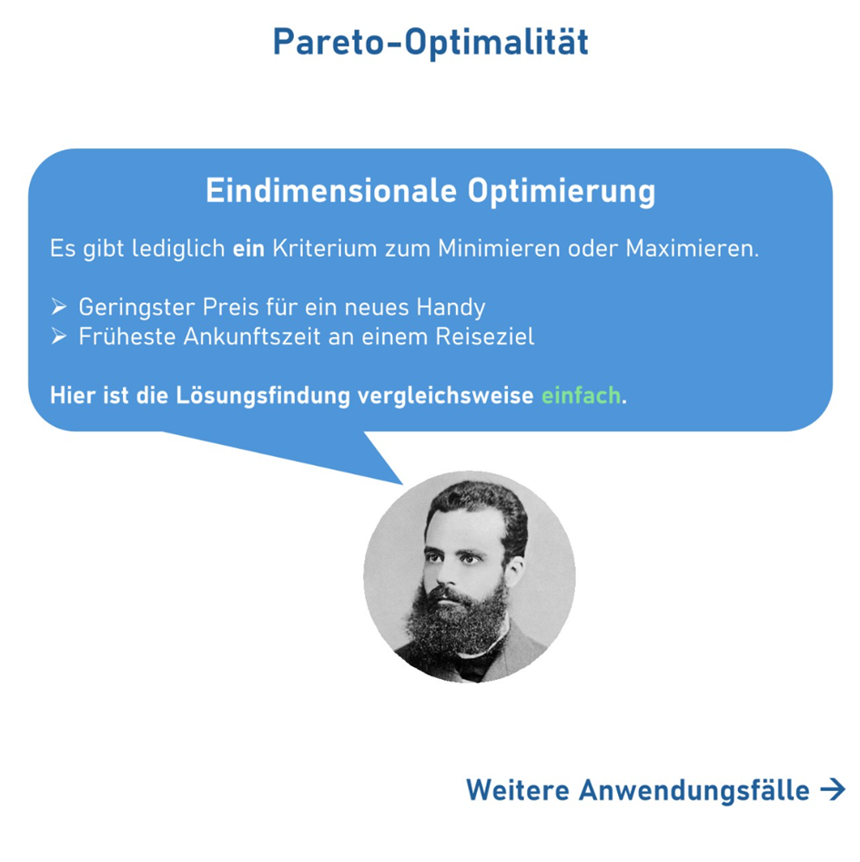
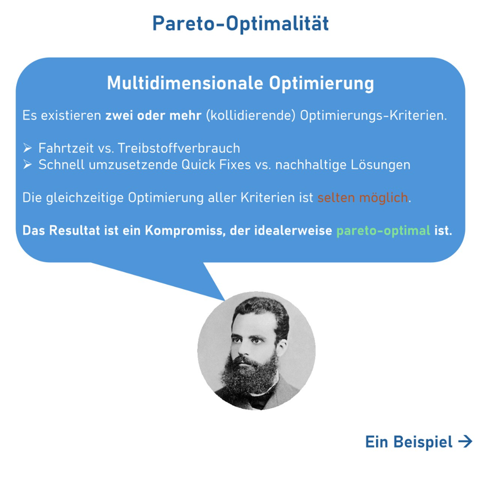
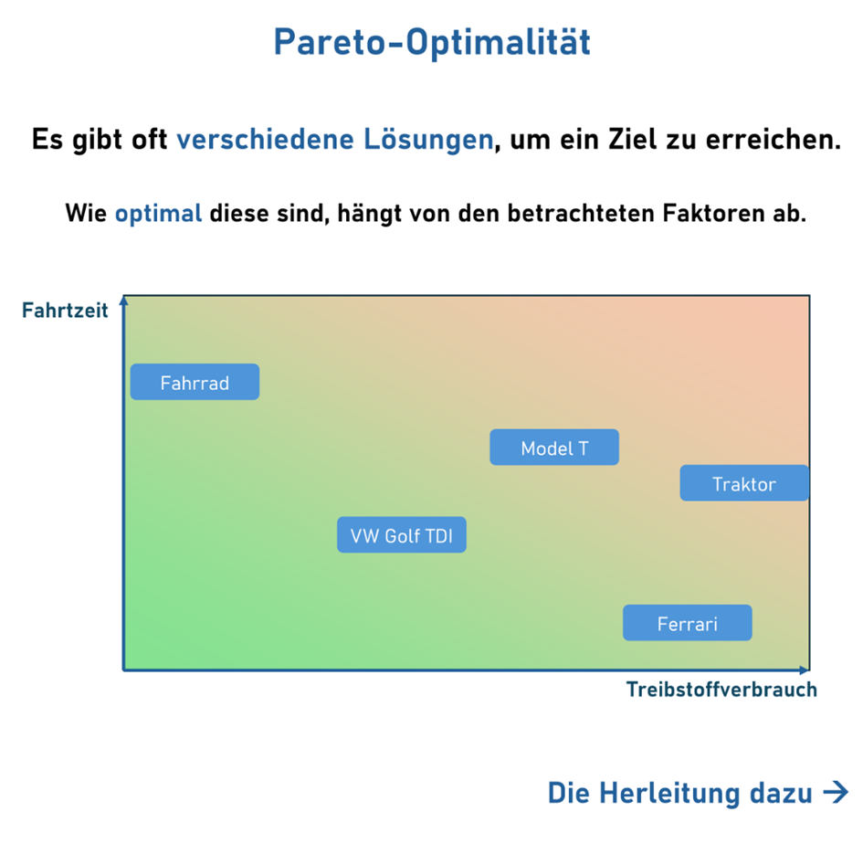
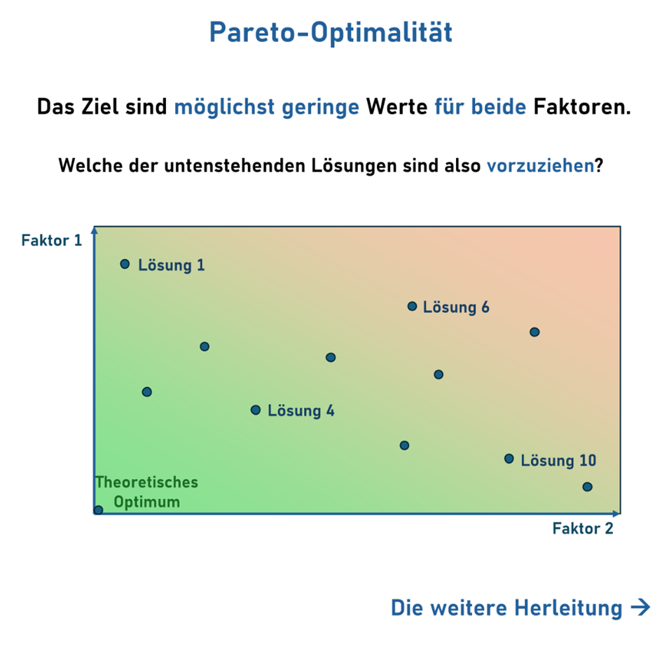
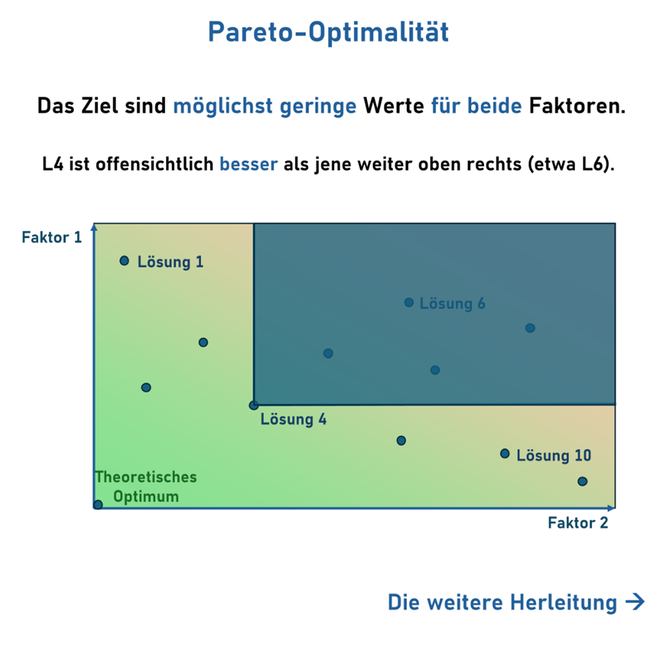
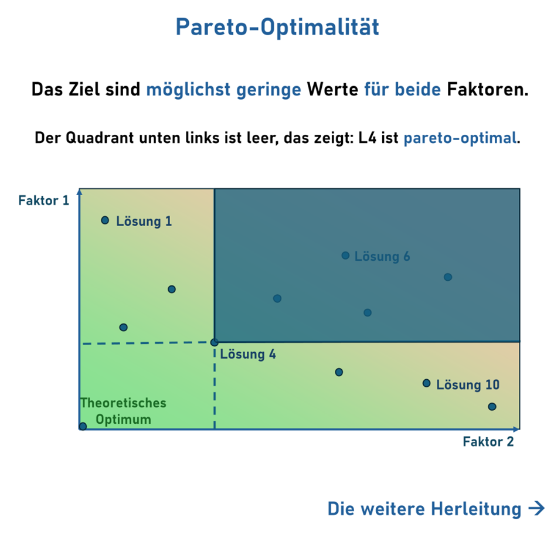
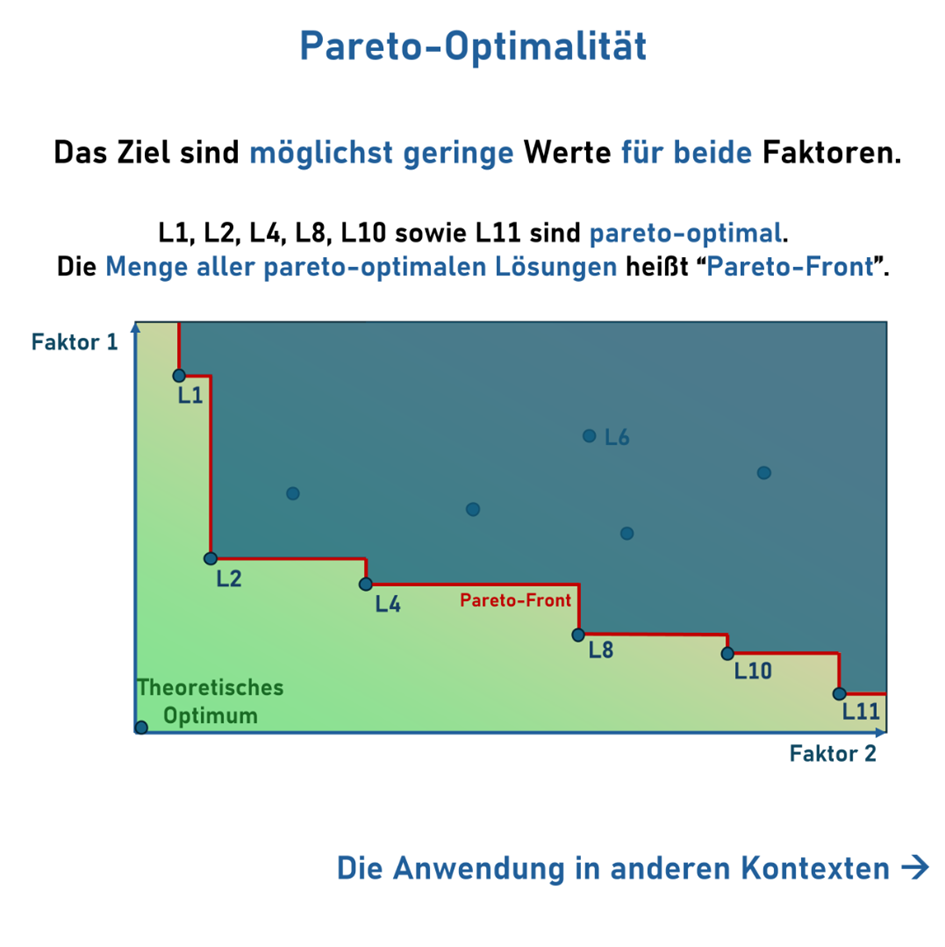
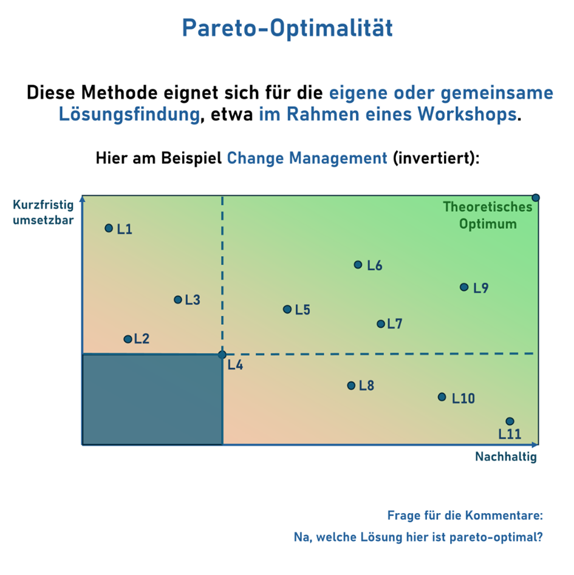

Du denkst bei Pareto nur an 80/20? Da geht noch mehr: Input für deinen Methodenkoffer! 🎒  
  
Ich habe das große Glück, mit sehr klugen Köpfen zusammenzuarbeiten.  
Entsprechend versuche ich mir möglichst viel abzuschauen und in meine tägliche Arbeit zu integrieren. 🧠  
  
In dem Fall die theoretische Basis um im Rahmen unserer HAFAS Routenfindung die optimale Verbindung anhand bestimmter Parameter zu berechnen. 🚄  
So lassen sich etwa kurze Fahrten ermitteln oder jene mit wenigen Umstiegen.  
  
Es gibt dabei meist Lösungen, die besser sind als andere. Von „Pareto-optimal“ spricht man in diesem Kontext, wenn es nicht möglich ist, eine Eigenschaft zu verbessern, ohne eine andere zu verschlechtern. ✅ 🔚  
  
Was habe ich mir davon abgeschaut? Die Pareto-Optimalität beispielsweise für‘s Change Management! 💡  
  
Oft höre ich „das muss jetzt sehr schnell passieren“ oder das Gegenteil: „Wir müssen das komplett durchdenken, damit es nachhaltig ist.“ Das Resultat sind dann unter Umständen Ergebnisse, die sich lediglich auf einen Faktor stützen und damit nicht optimal sind. Pareto-optimal! 🙅‍♂️  
  
Idealerweise implementieren wir Lösungen, die ein möglichst optimales Verhältnis zwischen verschiedenen Parametern aufweisen. Etwa schnell umsetzbar, wirksam und nachhaltig. 📊  
Hier hilft es, die möglichen Lösungen (bei zwei Parametern) an zwei Achsen auszurichten und miteinander zu vergleichen, um nicht optimale Lösungen zu verwerfen. 📈  
Bei mehr Dimensionen hilft ein Netzdiagramm (hier ausgeklammert). 🕸️  
  
Bisher habe ich das Vorgehen nur für meine eigene Methodenauswahl genutzt, könnte mir aber auch Workshops damit vorstellen. Damit lässt sich wunderbar auch Brainstorming auf eine vernünftige Entscheidungsgrundlage eindampfen. 💬  
  
⁉️ Was sagt ihr? Habt ihr – wie ich - damit etwas hilfreiches Neues gelernt? Probiert ihr‘s mal aus?

