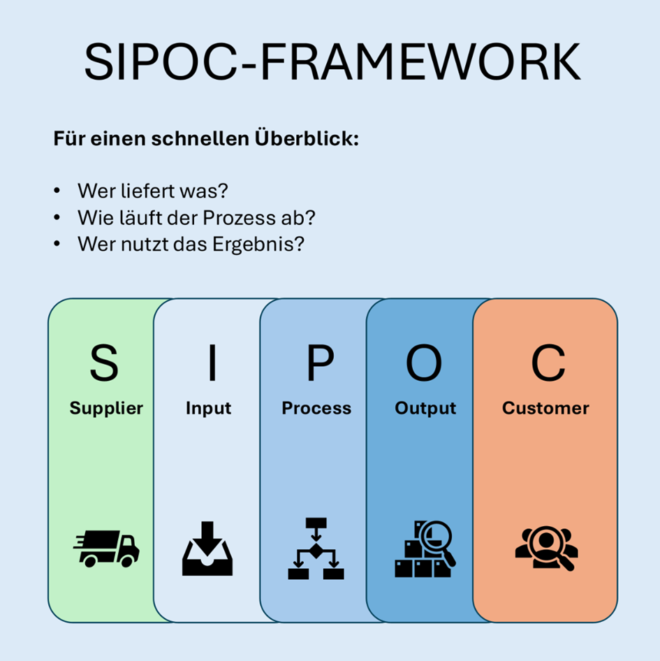
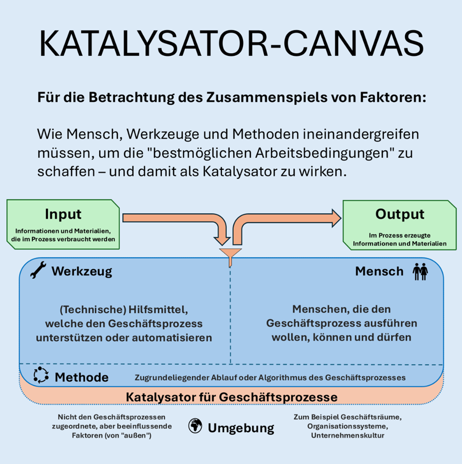

Deine Prozesse laufen? Schön!  
Aber laufen sie schon ... auf Höchstgeschwindigkeit? 🚀  
  
Wie SIPOC und das Katalysator Canvas dein Leben vereinfachen können, vor allem wenn du sie clever gemeinsam nutzt:  
  
Im Buch "Zellkultur" 🧫 von [Clemens Dachs](https://www.linkedin.com/in/clemens-dachs/) und [Moritz Hornung](https://www.linkedin.com/in/moritzhornung/) bin ich auf zwei Modelle gestoßen, die ich noch nicht kannte: "SIPOC" und das "Katalysator Canvas", wobei letzteres aus ihrer eigenen Feder stammt. 🧠  
  
Falls es dir geht wie mir und sie für dich neu sind:  
  
1️⃣ SIPOC ist ein Modell, bei dem die Prozesskette ganz explizit betrachtet wird. Suppliers, Input, Prozess(schritt), Output und Customers (SIPOC).  
  
Es wird der Prozess also explizit ganzheitlich betrachtet, damit er nicht nur Mittel zum Zweck ist. Kombiniert habe ich das mit Betrachtungen zu Outcome, Ziel und Prämissen / Constraints. 🎯  
  
❓ Was erhalten wir dadurch?  
\-> Einen schnellen Einstieg, der sich für die Prozessaufnahme oder den Check der Prozesse eignet. Es liefert einen guten Überblick und zeigt Abhängigkeiten auf.  
  
❗ Einschränkung: SIPOC bleibt eher auf der Meta-Ebene, es geht um das "Was", nicht das "Wie". Für detaillierte Analysen braucht es oft weitere Werkzeuge. ⚒️  
  
  
Okay, damit hätten wir das "Was" geklärt. Auf geht's zum "Wie"! ➡️  
  
  
2️⃣ Das Katalysator-Canvas  
  
Das Prinzip: Das Katalysator-Canvas zoomt tief in die entscheidenden Erfolgsfaktoren eines Prozesses hinein: Mensch, Werkzeug, Methode, Input, Output und Umgebung.  
Das Ziel ist es, \*Beste Arbeitsbedingungen\* zu schaffen. 🥇  
  
Deshalb wird hier aufgenommen, was es hierfür braucht. Sollgrößen also. 📝  
Der Vorteil: Durch die gezielte Betrachtung der Elemente entsteht ein sehr praxisnahes Bild, das schnell verrät, wo es hakt. ❌  
  
Die Umgebung 🌍 ist hier übrigens zwar außen vor, aber kritisch für das Zusammenspiel aller anderen Elemente.  
  
Auf diese Weise wird sichtbar, ob den Menschen bspw. das richtige Know-how fehlt, ob die vorhandenen Tools wirklich passen – oder ob die gewählte Methode an einigen Stellen unvollständig ist.  
  
Wenn alle Faktoren nahtlos zusammenspielen, beschleunigt das den Prozess. 📈  
Fehlt nur ein Aspekt, kann das wiederum den Flow erheblich bremsen. 📉  
  
  
⁉️ Wann ist welches Framework sinnvoll?  
\-> Möchtest Du rasch ein erstes Verständnis deiner Prozesse gewinnen oder handelt es sich um einen komplizierten Sachverhalt (🔵), ist SIPOC ein hervorragender Einstieg.  
\-> Für eine tiefe Analyse und komplexe Sachverhalte (🔴) empfiehlt sich das Katalysator-Canvas.  
  
💡Fazit:  
Am besten lässt man die beiden Ansätze Hand in Hand arbeiten. Zuerst verschaffst du dir mit SIPOC einen strukturierten Gesamtüberblick, danach sorgst du mit dem Katalysator-Canvas für den Feinschliff, indem du prüfst, ob die entscheidenden Faktoren harmonieren, zur Herstellung \*bester Arbeitsbedingungen\*! 🚀 📈 🤘  
  
🙍‍♀️🙍‍♂️ 💬 Wie ist es mit dir? Nutzt du bereits SIPOC oder das Katalysator-Canvas? Hast du was gelernt..?  

