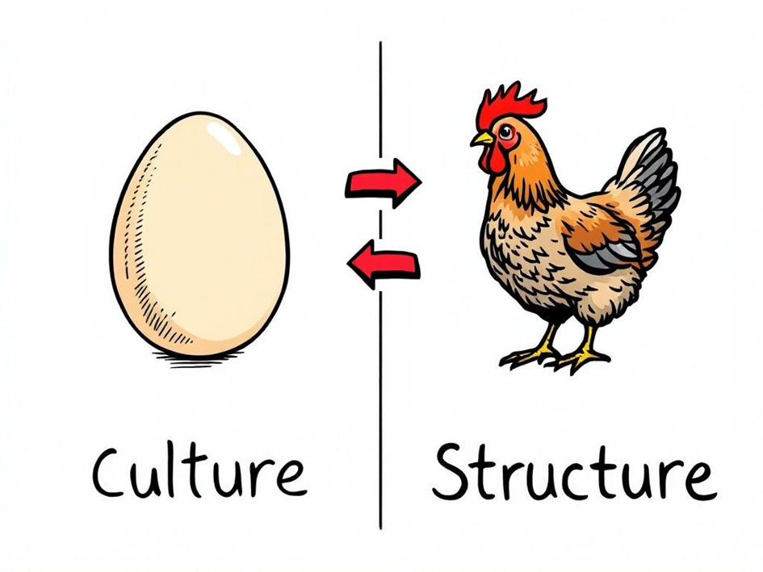
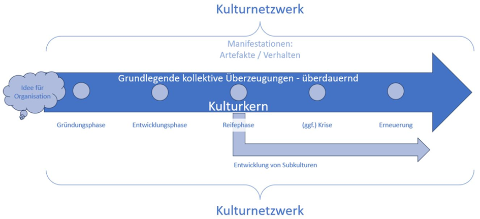

Was kommt zuerst, Struktur oder Kultur? 🥚🐔  
  
Wer meinen Post zum integralen Modell gesehen hat, weiß: Beides stimmt. Es handelt sich um einen Kreislauf. 🔄️  
  
Wie versprochen hier daher Nummer 5️⃣ von Larman's Gesetzen des Organisationsverhaltens:  
  
"In kleineren, noch jungen Organisationen folgt die Struktur der Kultur.  
In größeren, reiferen Organisationen gilt: Die Kultur folgt der Struktur."  
  
Folgt man dem Modell von **Sonja Sackmann** (s. Bild 2 im Reel), so erkennt man, dass sich in jungen Organisationen das Wesen der Gründer:innen auf die Organisation überträgt. Damit auch die Art, Probleme zu lösen. 🧠  
  
Vieles geschieht zum ersten Mal, etablierte Prozesse gibt es kaum. Hier ist vor allem das Verhalten das prägende Element.  
Der Kulturkern manifestiert sich dann in gewissen formalen Strukturen. Entsprechend folgt hier die Struktur der Kultur. 🥚➡️🐔  
  
Werden nun in der Organisation weitere Erfahrungen gemacht und die Vorgehensweisen angepasst, bildet sich über die Zeit ein Kulturnetzwerk. Diese werden ebenfalls kodifiziert und sind damit als struktureller Rahmen wiederum handlungsleitend.  
Die Kultur, als informeller Schatten erfolgreichen Verhaltens, folgt der Struktur. 🐔➡️🥚  
  
Das im Kopf zu haben hilft mir sehr häufig. Insbesondere dabei, zu verstehen, warum eine Organisationen auf eine bestimmte Weise "tickt" und wo die Hebel liegen für erfolgreichen Change. 🕵️‍♂️  
  
Übrigens: Gerade aufgrund der Tatsache, dass beides - Kultur und Struktur - nicht einfach vom Himmel fallen, sondern sich in Wechselwirkung entfalten, ist es immer gut einen Blick auf die Historie der Organisation zu werfen. Auch heutiges dysfunktionales Verhalten war mal nützlich, sonst wäre es nicht da.  
  
Larman's Laws, v.a. Nummer 5: Für mich ein absoluter Gamechanger.

