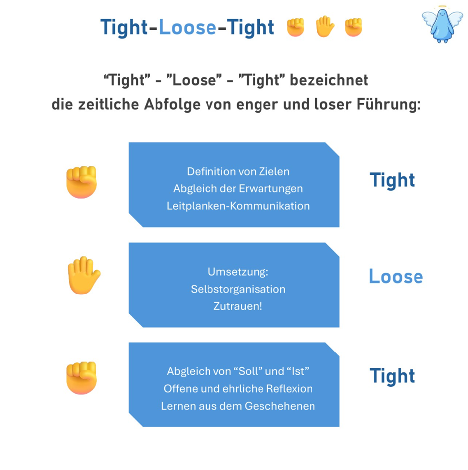

Einer der aus meiner Sicht häufigsten Führungsfehler ist die Verkehrung des folgenden Führungsprinzips:  
  
Tight-Loose-Tight! ✊️✋️✊️ ✅  
  
Worum geht's?❓️  
  
"Tight-Loose-Tight" bezeichnet die zeitliche Abfolge von enger und loser Führung, auch im Rahmen von Delegation.  
  
Dieses Prinzip ist beheimatet in agilen Kontexten, wo Selbstorganisation gewollt und möglich ist.  
Doch es wirkt natürlich nicht nur da, sondern bedeutet für mich im Kern gute Führung, die in (fast) allen Situationen anwendbar ist.  
  
✊️ Tight:  
Hier wird Klarheit geschaffen über die Rahmenbedingungen, die Erwartungen und die Zielsetzung. Leitplanken werden gesetzt.  
  
✋️ Loose:  
Loslassen! Zutrauen! An dieser Stelle tritt die Selbstorganisation in Kraft. Je besser Schritt 1 war, desto besser (in der Regel) das, was in dieser Umsetzungs-Phase passiert.  
  
✊️ Tight:  
Hier wird genau geschaut, ob die gesetzten Ziele erreicht wurden. Hier geht man in den offenen Austausch. Welche Lehren werden daraus gezogen für die nächste Iteration? (Ihr merkt, das riecht nach Scrum!)  
  
Dieses Vorgehen hat viele positive Effekte: Entlastung der Führungskraft, Selbstwirksamkeitserleben bei den Geführten, nachhaltige Lerneffekte, ...  
  
Jetzt das Paradoxe: Leider erlebe ich oft (vor allem in agilen Transformationen!) die Verkehrung ins Gegenteil. Hier regiert dann...  
  
Loose-Tight-Loose! ✋️✊️✋️❌  
  
Es wird zu Beginn also wenig bis keine Klarheit geschaffen, was oder wie etwas (nicht) zu tun ist. Die entstehende Unsicherheit und das potenzielle Chaos in der Umsetzung wird deshalb durch direkte Steuerung (Micromanagement!) "weggemanaged". Am Ende bleibt dann - neben dem Frust bei allen Beteiligten aufgrund des oft schlechteren Ergebnisses und etwaiger Konflikte - Ratlosigkeit. Man beschäftigt sich nicht mit der Vergangenheit (etwa im Rahmen eines Inspect & Adapts oder gar Soll-Ist-Abgleichs) sondern wirft sich in den nächsten Brandherd. Naja gut, das "Soll" wurde ja eh nicht richtig definiert. 🤷‍♂️  
  
Schade! Viel Potenzial, was da verschenkt wird. Es müssen aber auch einfach viele Dinge zusammenkommen, die ich selten erlebe. Der Unicorn-Moment🦄, quasi:  
  
Die Führungskraft muss sich klar darüber sein, was sie will. Sie muss sich Zeit dafür nehmen, selbst die Zielsetzung zu verstehen \*und\* adäquat zu vermitteln. Die psychologische Sicherheit muss vorhanden sein, loslassen zu können. Bei der Führungskraft, den Geführten und den Stakeholdern. Die Organisation muss Ungewissheit und Fehler aushalten können. Vor allem in Transformationen ist das schwierig, da vieles Bekannte wegfällt. Das Konzept muss hinreichend bekannt sein, ... uff!  
  
⁉️ Fallen euch noch mehr Dinge ein, die  
Loose-Tight-Loose ✋️✊️✋️ begünstigen? Oder besser noch, die dafür sorgen, dass wir doch das Einhorn 🦄 zu Gesicht bekommen? Ich bin gespannt.. Was sind eure Erfahrungen zu dem Konzept?  

