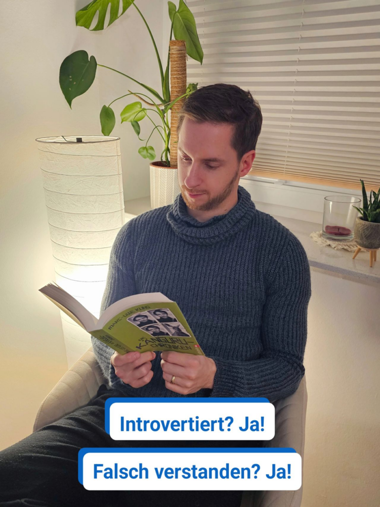

Ich bin einer der Menschen, die vor dem Verlassen der Wohnung darauf warten, dass im Hausflur das Licht ausgeht. 🤫  
  
Warum? Weil ich stark introvertiert bin. 🤷‍♂️  
  
Viele verstehen "introvertiert" und das zugehörige Pendant "extra(!)vertiert" falsch. Und stecken entsprechend veranlagte Menschen in Schubladen, wo sie gar nicht reingehören. 🗄❌️  
  
Denn: Ruhige Extravertierte sind genauso möglich und normal wie introvertierte Rampensäue 🐷.  
Die Hauptdifferenz liegt wo anders.  
  
Während bei Extravertierten vor allem Dopamin als Neurotransmitter für "positive Erregung" (den Kick!) sorgt, ist es bei Introvertierten Acetylcholin.  
  
Der Hauptunterschied, der sich dadurch im sozialen Kontext ergibt: Menschliche Interaktionen kosten Introvertierte mehr Energie, als sie ihnen gibt. Sie brauchen Ruhe zum Auftanken. Extravertierte tanken Kraft aus sozialer Interaktion. Introvertierte sind eher "im Innen", Extravertierte eher "im Außen".  
  
Und auch hier gibt es Ausprägungen:  
Ich bin beispielsweise extravertierter Introvert. Mir bereitet es Freude, Dinge zu präsentieren, vor großen Gruppen zu sprechen, zu coachen, muss mich aber danach und regelmäßig zurückziehen. Ein Buch lesen, nur meinen Gedanken nachhängen. Mehr als 1-2 Stunden am Stück geht zwar, fällt mir aber schwer. Meine Stärke liegt vor allem in der Deep Work und im Fokus. Dafür bin ich auch etwas langsamer, was ich aber akzeptiert habe.  
  
Und das ist das, was ihr aus diesem Post mitnehmen solltet: Die Mischung machts. Während ich punktuell extrem fokussiert auftreten kann, brauche ich ein Umfeld, das mir genau diese Freiräume schafft. Dafür bin ich gern Sparringspartner für meine hyper-schnellen Kolleg:innen. Zusammen sind wir dann unschlagbar. 🤜🤛  
(Neuro-)Diversität ist also ein Erfolgsfaktor!  
  
Meine Frau ist übrigens das genaue Gegenteil. Sie liebt es, Nachbarn "zufällig" zu treffen. Mein Glück, denn sie kümmert sich auch um unsere sozialen Kontakte. Meine Freunde wissen das und wenden sich einfach immer an sie, um mich nicht zu überfordern. 😄🤷‍♂️  
  
Wie ist es mit dir? Bist du (eher) introvertiert oder extravertiert? Wie erlebst du das im Job und privat?  
Und, Hand aufs Herz: Wartest du auch, bis die Nachbarn den Flur verlassen haben?  
  
PS: Damit die oft missverstandene "Extrovertierte brauchen Action" Thematik noch geklärt ist: Das klassische Missverständnis zu Intro- und Intravertierten wird als "High Sensation Seeking" und "Low Sensation Seeking" Trait bzw. Persönlichkeitsmerkmal bezeichnet, falls ihr tiefer einsteigen wollt.  
  
Meine Frau ist übrigens "Low Sensation Seeker Extravert", womit dann dieser Mythos komplett ausgeräumt wäre. Sie steht stundenlang bei den Nachbarn zum Tratschen für Smalltalk (während ich es nicht abwarten kann, das Gespräch zu beenden), generell ist unser Leben aber sehr ruhig. Was wir beide genießen.

