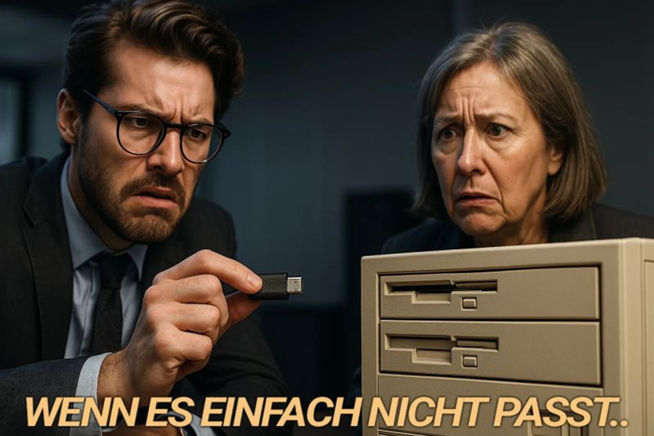

"Die Menschen wollen verführt werden."  
  
So steht es in einer gut geschriebenen Kolumne von [Kai Matthiesen](https://www.linkedin.com/in/kaimatthiesen/) (Link in den Kommentaren).  
  
Aus Erfahrung kann ich sagen: Das stimmt. Denn das ist einer der Aspekte der Anschlussfähigkeit - damit sich überhaupt etwas bewegt. 🫸🏻💢  
  
Aber sie müssen auch können, dürfen, sollen, kennen – und wie erwähnt: wollen. Ob durch kurzfristigen Impuls von außen oder länger bestehenden Wunsch ist dabei egal.  
  
  
👉🏻 Ich sehe es immer wieder:  
Coaches, Berater:innen, Change-Initiativen – mit brillanten Ideen, klaren Konzepten, besten Absichten.  
Und trotzdem: Nichts bewegt sich.  
Weil das Entscheidende fehlt: Anschlussfähigkeit. 🧩  
  
Nicht nur kommunikativ (obwohl das auch wichtig ist).  
Sondern systemisch-holistisch.  
  
Denn eine Idee kann noch so gut sein:  
Wenn sie im System keinen Platz findet, bleibt sie außen vor. 🙅‍♂️⛓️‍💥  
  
  
🔗 Anschlussfähigkeit heißt:  
  
Ist das Ziel klar? (kennen)  
  
Haben die Beteiligten die Fähigkeiten? (können)  
  
Gibt es Erlaubnis und Spielraum? (dürfen)  
  
Wird es erwartet? (sollen)  
  
Gibt es Motivation dafür? (wollen)  
  
  
Ohne diese fünf Dimensionen bringt selbst der beste Impuls – nichts.  
So wie ein Stecker, der einfach nicht in die Dose passt. 🔌💥  
Da hilft keine Überzeugung, kein PowerPoint, kein TED-Talk-Charisma. 💁‍♂️✨️  
  
Systeme nehmen nur auf, was sie integrieren können.  
  
Deshalb:  
Wer wirklich wirksam sein will, muss nicht noch schlauer, lauter, richtiger werden.  
Sondern anschlussfähiger. 🤝  
  

