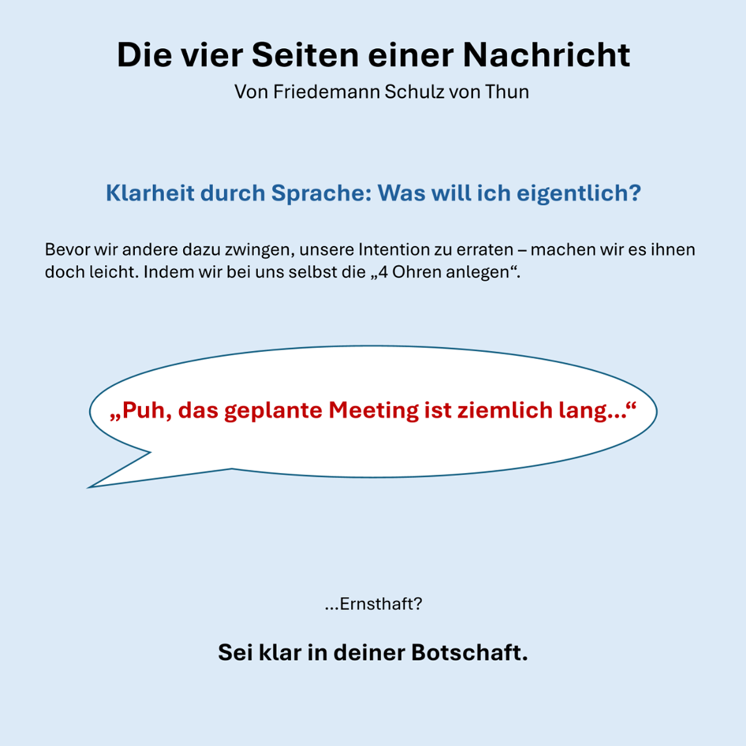
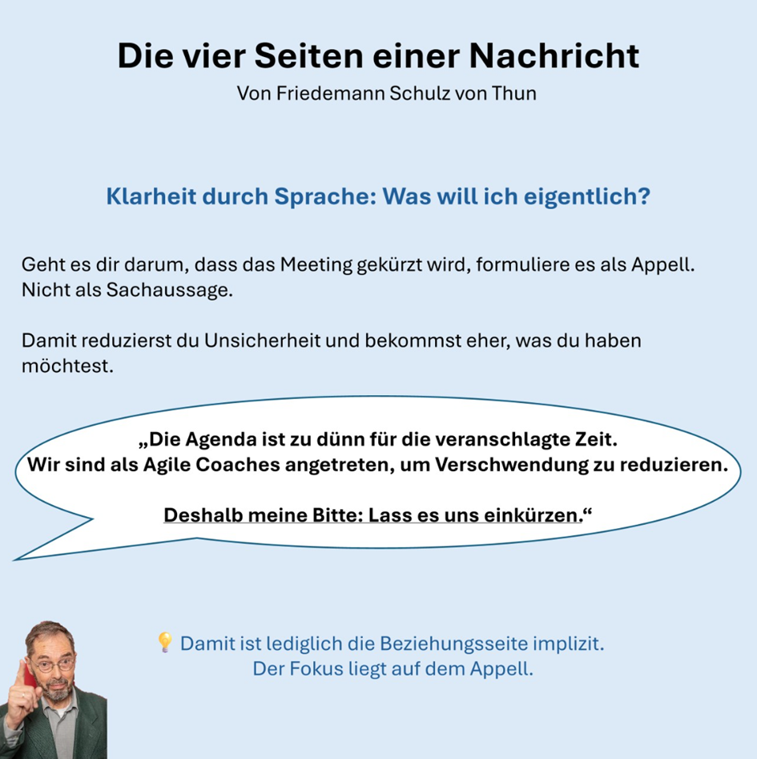
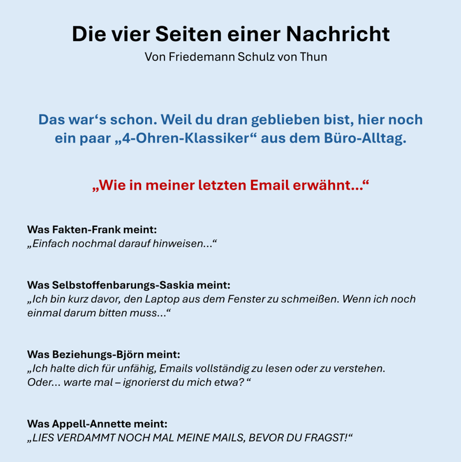
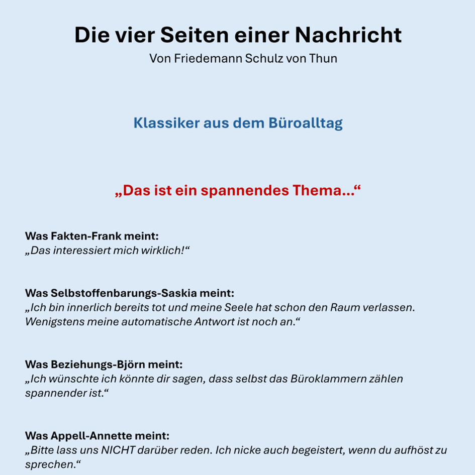

Du verwendest die "vier Seiten einer Nachricht" zum Analysieren von Botschaften anderer? Pah - das ist die Amateurliga!  
  
So, jetzt wo ich dich hier habe:  
  
Das 4-Ohren Modell nach Friedemann Schulz von Thun ist für Kommunikationswissenschaftler:innen das, was Helene Fischer für Schlagerfans ist: Kult. Jeder kennt es, jeder liebt es. 🎤  
  
Aber nur zu untersuchen, was schon gesagt wurde, klingt für mich nach verschwendetem Potenzial. Warum deinem Gegenüber aufbürden, zufällig das Ohr zu nutzen, das dir beim Senden der Nachricht am wichtigsten ist? 👂  
  
Nimm es selbst in die Hand. 💁‍♂️  
  
Im Funkverkehr gibt es den Leitspruch: "Denken, drücken, sprechen." 📞  
  
Ersetze hier einfach "drücken" durch eine schnelle Schulz-von-Thun-Analyse deiner Worte, bevor du sprichst oder die Nachricht abschickst.  
  
Was ich damit sagen möchte: Mach dir Gedanken.  
Ist das, was du gerade aussprechen möchtest, das, was du \*wirklich\* willst?  
  
Ein wages "Der Müll ist voll..." (Fokus auf der Sachaussage!) mit implizitem Handlungswunsch ist sicherlich langfristig konflikterzeugender und auch akut weniger wirksam als "Würdest du bitte den Müll rausbringen, Schatz?".  
  
Der Appell steht hier im Vordergrund, trotzdem wurden die anderen vier Seiten bewusst bespielt.  
  
  
Versuch's mal, ich wette es macht was mit dir und deiner Umgebung.  
  
❓ An alle, die das Modell kennen: Wie nutzt ihr es?  
⁉️ An alle, die das Modell noch nicht kannten: Gern geschehen. 😄  
  
Was nehmt ihr mit? 🧠

