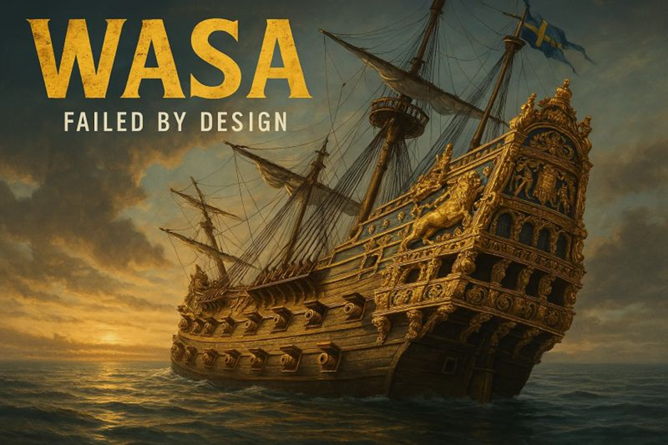

Wie versenkt man ein Mega-Projekt in 30 Minuten? Eine Anleitung von 1628:  
  
Stellt euch vor, ihr arbeitet jahrelang an einem Prestigeprojekt.  
Alles läuft super und das Topmanagement ist happy.  
  
Dann der Launch.  
  
30 Minuten später ist vom ehemaligen Glanz nichts mehr zu sehen.  
  
Eine Stunde später liegt euer Projekt am Grund des Meeres. Und damit nicht nur eine Menge Hoffnungen und Ambitionen, sondern auch ein ganzer Batzen Geld - und Jahre eurer Zeit.  
  
Genau so ist es damals den Menschen ergangen, die im 17. Jahrhundert am Bau des königlichen Kriegsschiffs Wasa beteiligt waren.  
  
Aber was lief hier eigentlich so massiv schief? Und warum ist diese Geschichte auch nach fast 400 Jahren so aktuell für unser Verständnis von Organisationen?  
  
  
🛳 Überambitionierte Ziele und wenig Verständnis fürs Gesamtsystem:  
  
König Gustav II. Adolf hatte Großes im Sinn. Nichts war genug.  
Eine weitere goldene Kanone? Klar!  
Doch jede zusätzliche Kanone und jeder höhere Aufbau destabilisierten das Schiff weiter. Ein leichter Windstoß ließ es kippen. 🌬🚢  
  
Heute bedeutet das: Wir müssen bei unseren Entscheidungen systemische Auswirkungen bedenken und gut auf Scope Creep achten.  
  
  
🛳 Fehlende psychologische Sicherheit  
  
Einige Ingenieure kannten die Probleme, doch aus Angst vor Konsequenzen wagten sie keine offenen Diskussionen. Wer wagt schon, dem König zu widersprechen? 🤴  
  
Auch heute führt Angst vor negativer Bewertung oft dazu, dass kritische Stimmen verstummen.  
Unternehmen, die erfolgreich sein wollen, müssen bewusst eine Kultur schaffen, in der Mitarbeitende offen und angstfrei Risiken und Fehler ansprechen dürfen.  
  
  
🛳 Gruppendenken  
  
Aufgrund einer sehr homogenen Gruppe von Entscheidungsträgern und fehlender externer Perspektiven entwickelten sich kollektive Denkfehler. Man bestätigte sich gegenseitig, anstatt unterschiedliche Sichtweisen zu integrieren.  
  
Organisationen sollten daher bewusst Vielfalt fördern und externe Perspektiven einbinden, um dem Gruppendenken entgegenzuwirken und robustere Entscheidungen zu treffen.  
  
  
🛳 Fehlende Prüf- und Feedback-Schleifen  
  
Natürlich lässt sich ein großes Kriegsschiff nicht so einfach iterativ bauen und testen wie Software. Aber auch hier wären regelmäßige systematische Prüfungen und frühzeitige Stabilitätstests möglich und notwendig gewesen.  
  
Für heutige Organisationen bedeutet das: Auch wenn iterative Prozesse nicht trivial sind, regelmäßige Reviews und kritische Zwischentests erhöhen die Wahrscheinlichkeit, Probleme rechtzeitig zu erkennen und zu korrigieren.  
  
  
🛳 Unklare Verantwortlichkeiten  
  
Weil die Verantwortung nicht eindeutig geregelt war, handelte am Ende niemand rechtzeitig.  
  
Diese Verantwortungsdiffusion zeigt sich auch heute häufig: Organisationen brauchen klar definierte Rollen und Verantwortlichkeiten, um in kritischen Momenten handlungsfähig zu bleiben.  
  
  
🧠 Die Geschichte der Wasa zeigt: Ambitionen sind nett, es braucht aber (auch) ein robustes System.  
  
💬 Hand aufs Herz: Hattet ihr auch schon einen Wasa-Moment?

