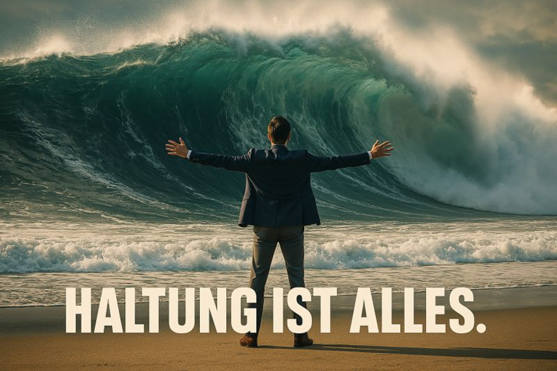

"Manchmal kommt Veränderung nicht planbar. Sie kündigt sich nicht an. Sie bricht herein."  
[Kolja Schönfeld](https://www.linkedin.com/in/koljaschoenfeld/).  
  
Egal, wie akribisch du dein Leben planst: Es wird mit großer Wahrscheinlichkeit anders kommen.  
  
Pandemie, Ukraine-Krieg, Trump. Nichts davon - und schon gar nicht die globalen Auswirkungen - hätte man 5 oder gar 10 Jahre vorher in dem Maße vorhersagen können.  
  
Das Leben passiert. Relevant ist deshalb, wie du damit umgehst.  
  
Wenn alles, was du tun kannst, das konsequente Ausrichten an deinem persönlichen Nordstern ist. Und die positive Haltung zu bewahren.  
  
Zu dem, was kommt; ob du damit gerechnet hast oder nicht.  
  
  
  
🙎💬🙎‍♂️ Planbarkeit des Lebens: Das war das bestimmende Thema zwischen [Sam Le](https://www.linkedin.com/in/qgsamle/) - meinem Mentee von [Netzwerk Chancen](https://www.linkedin.com/company/netzwerkchancen/) - und mir.  
Bei einem fantastischen Abendessen in Little Tokyo in Düsseldorf. 🍜  
  
Wir waren uns einig: Vor drei Jahren hätten wir unser heutiges Leben nicht vorhersagen können.  
  
Und deshalb haben wir keinen strikten Plan für die Zukunft. Sondern Werte, gewisse Ansprüche und vor allem eins: Haltung.  
  
Und so wissen wir, egal was die Zukunft an Überraschungen für uns bereit hält: Es wird gut.  
  
Richtig richtig gut. 🌊🕺  
  
  
💬 Wie ist es mit dir? Hast du einen Plan für die nächsten Jahre?

