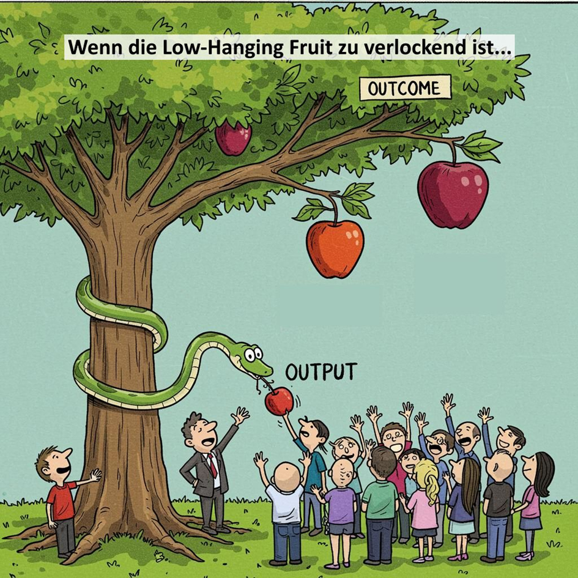

Viele Manager, Berater und auch (absurderweise) Coaches wirken super schnell; sie generieren unheimlich viel Output - Wirbel 🌪!  
  
... Aber ihr Wirken bringt kaum nachhaltigen Outcome oder gar Impact hervor. Trotzdem wird es honoriert und oft auch gefördert.  
  
Doch warum ist das so? ❓️  
  
Wir fühlen uns gut, wenn wir Dinge geschafft haben. Besonders, wenn wir sie anderen präsentieren können. ✅️ 🎉  
  
Wirkung (Outcome) tritt jedoch oft erst nach längerer Zeit ein, während Output unmittelbar sichtbar ist. Hier wird also die so genannte "Delayed Gratification" von der "Instant Gratification" geschlagen.  
(Unsichere) Belohnung mit Verzögerung vs. direkte Belohnung. 🎁 Klar, was da gewinnt.  
  
Dies betrifft vor allem Rollen ohne direkten Wertschöpfungsbezug, wo Ursache und Wirkung zudem schwer zuzuordnen sind. Ihr ahnt es: Unter anderem Management, Beratung und Coaching. 🤷‍♂️  
  
Hinzu kommt:  
Organisationen nutzen Aktionismus als Strategie zur Unsicherheitsreduktion. "Quick Wins" suggerieren Kontrolle, während echte komplexe Problemlösungen langsamer verlaufen. ⚙️  
  
Aus der Systemtheorie gilt:  
"What you see is all there is" - nur was gesehen wird, gilt auch was. 👀  
Der „Action Bias" bevorzugt daher sichtbare Aktivität gegenüber reflektiertem Abwarten. Menschen folgen diesem Bias, weil er sozial erwünscht ist. 🏆  
  
Kurzfristige KPI-Systeme verstärken diese Dynamik massiv. Sie schaffen automatisch Anreize für schnell sichtbaren Output, während nachhaltige Veränderungen unterbewertet bleiben. 📉  
  
So gilt: Menschen passen sich an das an, was honoriert wird. Wenn Organisationen systematisch kurzfristige Erfolge belohnen, adaptieren sich die Mitglieder - oft gegen eigene Überzeugungen. 🎖️😪  
Mit der Zeit füllen sich die Reihen mit Menschen, die durch dieses Verhalten aufgestiegen sind. So entsteht eine Kurzfrist-Kultur. 🏁🏃🏃‍♂️  
  
Vielen Entscheidern fehlt zudem systemisches Knowhow. Sie unterliegen dem Denkfehler der Linearität: Sie erwarten unmittelbare Effekte auf Initiativen, ignorieren jedoch Delay-Effekte. Dies führt dazu, dass langfristige Maßnahmen abgebrochen werden.  
  
Die Folgen sind gravierend:  
Individuen geraten in eine „Beschäftigungsfalle".  
Sie demonstrieren Aktivität statt ihre Wirksamkeit zu reflektieren. Frustration und Burnout-Gefahr steigen. Organisationen verlieren Innovationskraft sowie strategische Tiefe, erschöpfen Ressourcen und verlieren Talente. ☠️  
  
Gegensteuern erfordert outcome-orientierte Bewertungssysteme und eine Führungskultur, die nachhaltigen Mehrwert sichtbar macht.  
Entscheider sollten "the long game" spielen - mit einem gesunden Mix aus kurz- und langfristigen Zielen und passenden Metriken. ✔️  
  
Individuell, für alle gilt: Langfristigen Blick wahren, aber auch Öffentlichkeitsarbeit betreiben.  
Denn: What you see is all there is.  
  
🧠💬 Spielt ihr "the long game"?

