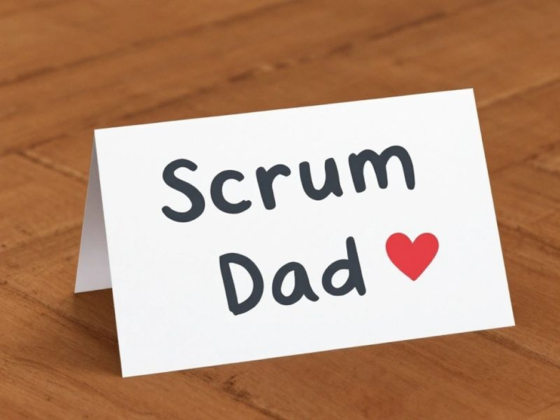

"Du tust genau das, was ein Scrum Master soll! Du sorgst dafür, dass es deinem Team gut geht. ❤️"  
  
Das stand mal auf einer "Kudos" Karte, die an mich ging.  
  
Und ab dem Moment habe ich in meinem Scrum Team andere Saiten aufgezogen. 🫨🪓  
  
Versteht mich nicht falsch: Ich finde, dass der Zugang über die persönliche Ebene eine wunderbare Möglichkeit ist, Akzeptanz für Veränderungen zu erreichen. Und auch so: Uns im Arbeitsalltag menschlich zu begegnen, ist eine tolle und wertvolle Sache. 🤜🤛  
  
Wird allerdings der Wert meiner Arbeit auf Feel-Good Management beschränkt, weiß ich: Da läuft etwas gehörig schief. Die Aufgabe eines Scrum Masters sollte es sein, auch unbequem zu sein. Zu irritieren. Den Status Quo zu hinterfragen und hart zu sein in der Sache, wenn es drauf ankommt. 🙅‍♂️  
  
Es ist viel zu einfach, als Scrum Master \*keinen\* wesentlichen Beitrag zur Wertschöpfung zu leisten. Etwa durch ein fehlendes Mandat. Also fallen alle Beteiligten im entstehenden Scrum-Zirkus auf das zurück, was möglich ist und sich gut anfühlt: Feel-Good Management. 🌈  
  
Deshalb habe ich dieses und weitere Feedbacks zum Anlass genommen, um meine Arbeit zu hinterfragen. Zum Wert, den ich schaffe. Denn davon profitiert mein Team langfristig - weit mehr als von Keksen zur lustigen Simpsons-Retrospektive. 🍪🤡  
  
Klar, das hat auch einen Wert. Dafür braucht es aber keinen Experten für Organisationsdesign, Führung oder agiles Projektmanagement. Es braucht keine extra Rolle, um Reflexion und Wertschätzung vorzutanzen. Ihr schafft das schon.  
  
Also ja: Die Kolleg:innen mussten daraufhin wieder mehr selbst tun. Und auch hart zur Verbesserung des Status Quo arbeiten. Sie haben aber erkannt, dass das der richtige Weg ist. Und waren dankbar dafür. Mehr als ich es je als "Scrum Dad" je geschafft hätte. 🧔‍♂️❌️  
  
Jetzt die Frage an die aktiven und ehemaligen Scrum Master da draußen: Ging es euch auch schon so, dass ihr in die Unterstützungsfalle getappt seid? Falls ja (und davon gehe ich aus) - was war euer Wachrüttller?

