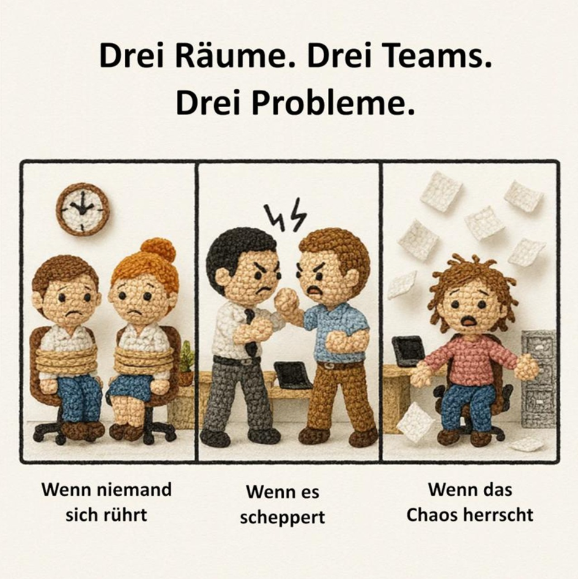
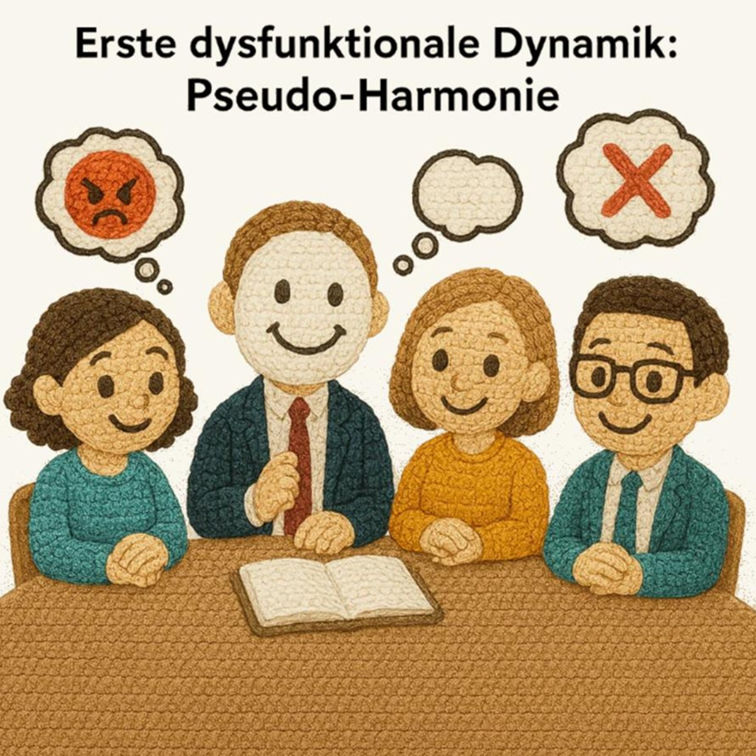
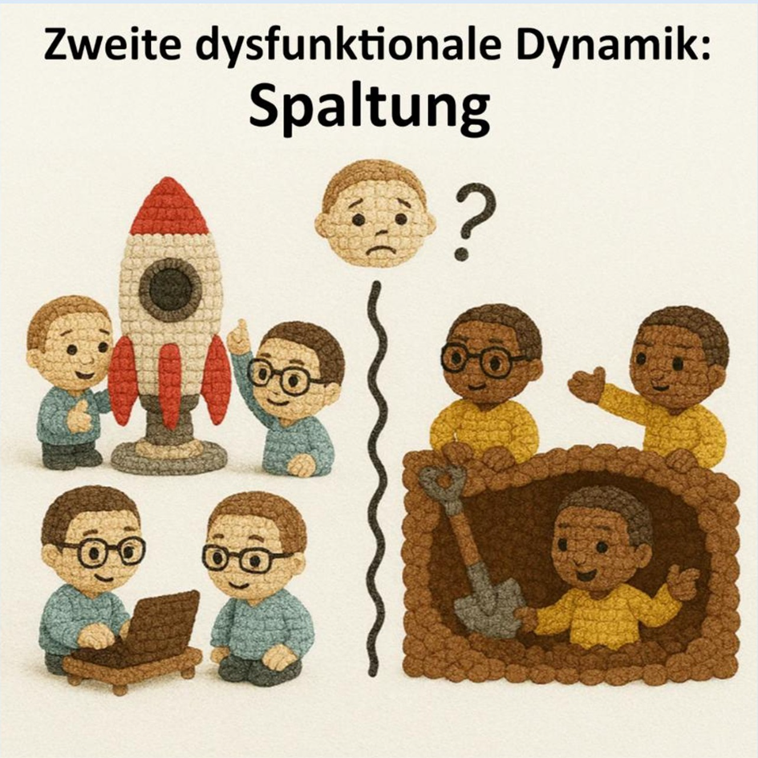

Drei Räume. Drei Teams. Drei Probleme.  
  
💓 Raum 1: Hier wird alles nur abgenickt, egal wie unsinnig eine Entscheidung auch ist. 0 Reibung, aber auch 0 Initiative. 😴  
   
💔 Raum 2: Anfeindung. Jede:r zieht in eine andere Richtung. Hier ist richtig dicke Luft. 😤  
  
❓Raum 3: Chaos. Niemand hier weiß, was zu tun ist. Alle sind beschäftigt, aber werden einfach nicht wirksam. 🏃🤷‍♂️🏃‍♂️‍➡️  
  
Drei Räume. Drei vermeintlich unterschiedliche Situationen.  
  
Und doch verbindet diese drei Situationen etwas Grundsätzliches...  
nur sieht man es auf den ersten Blick nicht. 🧐  
  
Im (immer noch empfehlenswerten) Podcast [**systemisch - agil**](https://www.linkedin.com/company/systemischagil/) mit [**Martin Schenkenberger**](https://www.linkedin.com/in/martin-schenkenberger-96541088/) und [**Florian Zapp**](https://www.linkedin.com/in/florian-zapp-384876202/) beschreibt [**Torsten Groth**](https://www.linkedin.com/in/torsten-groth-14bb2baa/) drei Dynamiken, die er aus der systemtheoretischen Perspektive nach [**swf - Simon Weber Friends**](https://www.linkedin.com/company/swf-simon-weber-friends/) ableitet / erläutert.  
  
Sie zeigen, was in Organisationen geschieht, wenn zentrale funktionale Faktoren nicht ausreichend vorhanden sind. Dann greifen bestimmte Muster:  
  
  
🗡️👩‍❤️‍👨 𝐏𝐬𝐞𝐮𝐝𝐨-𝐇𝐚𝐫𝐦𝐨𝐧𝐢𝐞:  
Dass es keine Konflikte gibt, wirkt konstruktiv, ist aber oft der Ausdruck fehlender psychologischer Sicherheit.  
Denn wenn unklar ist, welche Positionen in der Gruppe erlaubt sind, wird Abweichung vermieden und echte Auseinandersetzung miteinander und mit der Sache verhindert. 🤐  
  
  
🪓 𝐒𝐩𝐚𝐥𝐭𝐮𝐧𝐠:  
Unterschiedliche Abteilungen oder Führungsebenen verfolgen gegensätzliche Ziele. Jede aus ihrer Logik heraus plausibel.  
Der Grund? Fehlende strategische Kohärenz. Wenn kein geteilter Orientierungsrahmen existiert, entstehen Fragmentierung und Konflikte. 💔💣  
  
  
🤪 𝐂𝐡𝐚𝐨𝐬:  
Neue Strukturen, agile Rollen, viel Bewegung – aber niemand weiß so genau, was das eigentlich bedeutet.  
Hier zeigt sich eine andere Form von Unsicherheit: Rollenunklarheit, Prozessdiffusität, widersprüchliche Erwartungen. Orientierung fehlt und wird durch Aktionismus ersetzt. 🤔 🚀 💥  
  
  
Was all diese Phänomene verbindet?  
  
Nicht mangelnder Wille. Nicht Inkompetenz. Sondern - aus meiner Sicht: 𝐔𝐧𝐬𝐢𝐜𝐡𝐞𝐫𝐡𝐞𝐢𝐭. 😵‍💫  
  
Systemisch betrachtet ist Unsicherheit ein ganz normaler Zustand. Sie wirkt sich allerdings dysfunktional aus, wenn Organisationen keine Wege finden, mit ihr umzugehen.  
  
  
Was also hilft?  
  
𝐊𝐞𝐢𝐧𝐞 𝐏𝐚𝐭𝐞𝐧𝐭𝐫𝐞𝐳𝐞𝐩𝐭𝐞.  
  
Aber: Räume, in denen Unterschiede sagbar werden. Strategiearbeit, die nicht im Vorstandsbüro versickert. Rollen, die nicht nur verkündet, sondern gemeinsam verstanden werden. 🤝  
  
Klarheit in Ausrichtung, den Handlungen und in der Kommunikation. 🧭  
  
Klingt banal – ist in der Praxis aber oft ein schwieriger Schritt. In Konzeption 𝐮𝐧𝐝 Umsetzung.  
  
  
🧠 Ihr habt sicherlich solche Dynamiken auch schon erlebt, entweder in Reinform oder als Mischform.  
  
Daher:  
  
💬 Ist meine Ursachenzuschreibung aus eurer Sicht sinnig?  
Und habt ihr Erfahrungen gemacht, solchen Dysfunktionalitäten (erfolgreich) zu begegnen?

