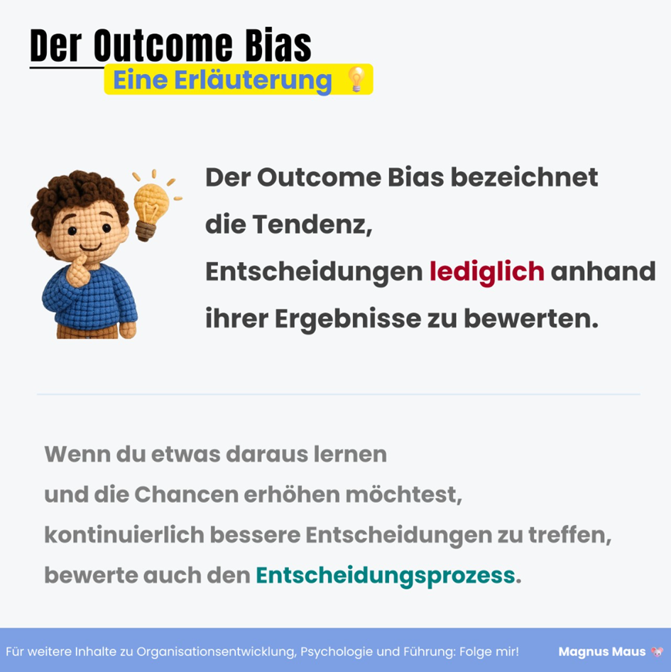

Wir Menschen lieben Heldengeschichten. Dumm nur, dass sie meistens konstruiert sind. 🤷🏻  
  
Glaubst du nicht?  
  
Klassisch LinkedIn: Die Mär vom Superstar CEO, der auf wundersame Weise den Turnaround des Unternehmens schafft.  
Quasi 👏🏻 im 👏🏻 Alleingang!  
  
  
📖👴🏻💬 Das Schiff segelt auf die Felsen zu. Eine Kollision ist fast schon unvermeidlich, das Kentern nur eine Frage der Zeit.  
Doch dann: Der neue CEO übernimmt das Ruder, stemmt sich mit aller Kraft ins Steuerrad. Und schafft das Unerwartbare: Er reißt es tatsächlich herum und rettet das Schiff und alle 1.392 Menschen darauf. ✨  
  
Also wird er wieder als Kapitän eingesetzt.  
  
Und scheitert. Vielleicht sogar so grandios, wie ich es vor kurzem am Beispiel der Vasa skizziert habe. 🌊  
  
👉 Das ist gar nicht so selten. Denn wir lassen uns gern packen.  
Von guten Geschichten und dem Glauben an Helden. 🦸🏻  
  
  
Ein paar Beispiele:  
  
💥 Von Top zu Flop:  
  
Andy Palmer: Bemerkenswerter Aufschwung bei Aston Martin 2014. 
Ab 2018 allerdings unter der gleichen Führung enorme Schwierigkeiten. Der Aktienkurs fiel um 94% und Palmer trat 2020 zurück.  
  
  
💫Von Flop zu Top:  
  
Cheryl Bachelder: Verließ 2003 KFC, nachdem der gewünschte Erfolg ausblieb. Beim Fast Food Unternehmen „Popeyes“ stieg unter ihrer Führung der Aktienkurs jedoch von 15 auf 79 Dollar.  
  
  
🤔 Komisch. Fast, als könnte man im Vorfeld in einer komplexen Welt gar nicht genau sagen, wie sich bestimmte Entscheidungen auswirken…  
  
📺 Live könnt ihr es übrigens bei [**Bill Anderson**](https://www.linkedin.com/in/servinglifescience/) verfolgen. Hat man das Gefühl, es geht gerade im Rahmen der Transformation mit Bayer voran:  
  
Gute Nachrichten - guter Anderson – gute Entscheidungen!  
  
Tut es das nicht? - Richtig:  
  
Schlechte Nachrichten – schlechter Anderson – schlechte Entscheidungen.  
  
  
Von der Fairness mal abgesehen: Ist das überhaupt sinnvoll? - Nö.  
  
Passiert trotzdem und ist normal. So normal, dass es dafür einen Begriff gibt: 𝗢𝘂𝘁𝗰𝗼𝗺𝗲 𝗕𝗶𝗮𝘀.  
  
Er beschreibt die Tendenz, die Qualität einer Entscheidung nachträglich am Ergebnis zu messen, statt am Entscheidungsprozess selbst.  
  
Systemisch betrachtet ist das hoch problematisch:  
 Denn Entscheidungen entstehen unter Unsicherheit.  
 Sie basieren auf selektiven Informationen, Zielkonflikten und organisationalen Dynamiken.  
  
Wenn im Nachhinein nur das Ergebnis zählt, gehen drei Dinge verloren:  
Kontext, Prozessqualität, Lernfähigkeit.  
  
Statt nachvollziehbarer Entscheidungslogik bleibt nur eine rückblickend konstruierte Kausalität.  
  
  
Was sollten wir also stattdessen tun, statt Menschen und ihre Entscheidungen am Ergebnis zu messen?  
….  
🥁  
….  
Genau! Den Prozess der Entscheidungsfindung.  
   
   
Wer Organisationen gestalten will, braucht eine andere Praxis weg von reinen Betrachtung der Resultate.  
  
 Nämlich: „Wie wurde entschieden – und war das unter den damaligen Bedingungen nachvollziehbar?“  
Denn Qualität zeigt sich nicht daran, ob etwas funktioniert hat, sondern daran, wie unter Unsicherheit gehandelt wurde.  
  
  
🧠💬 Was ist mit euch? Seid ihr Team Heldenmythos?

