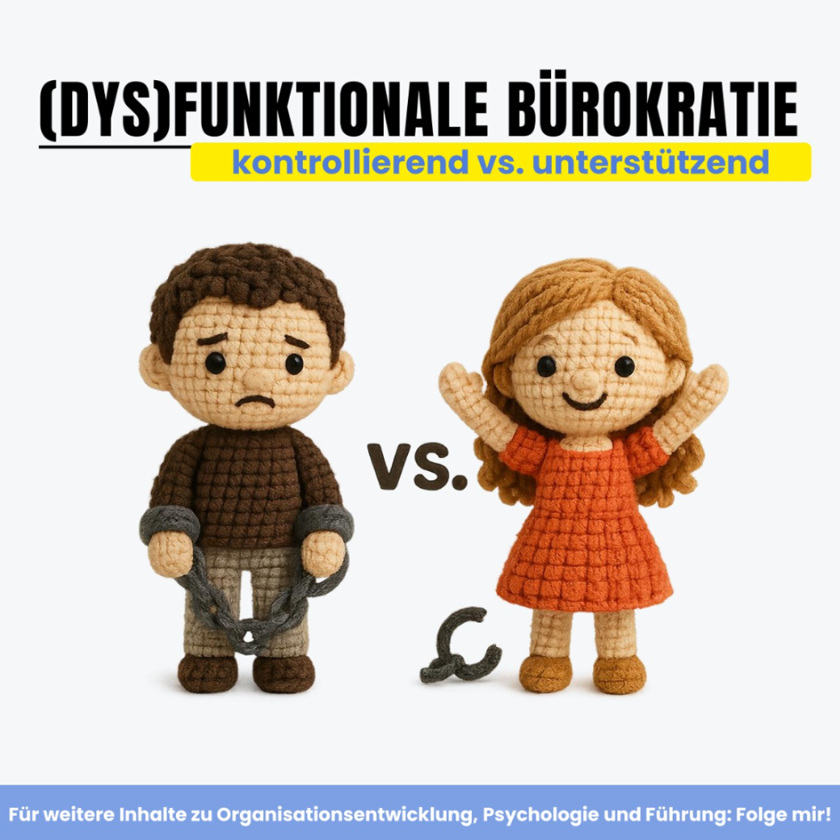
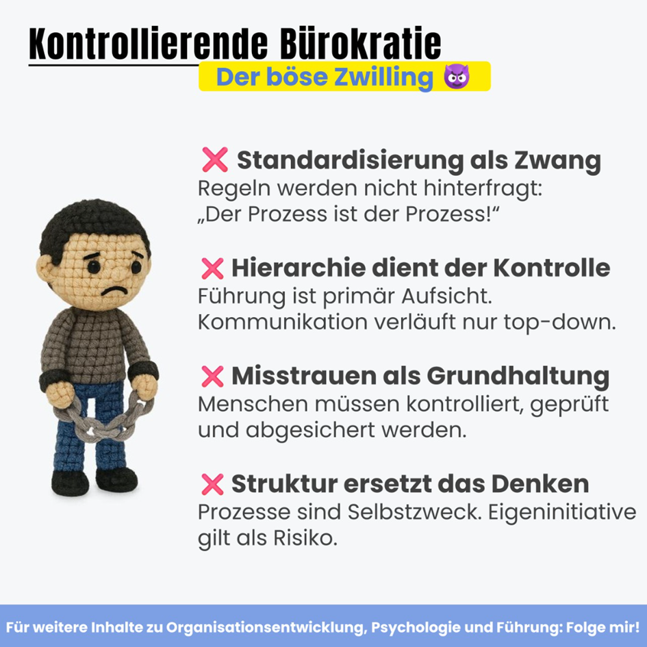
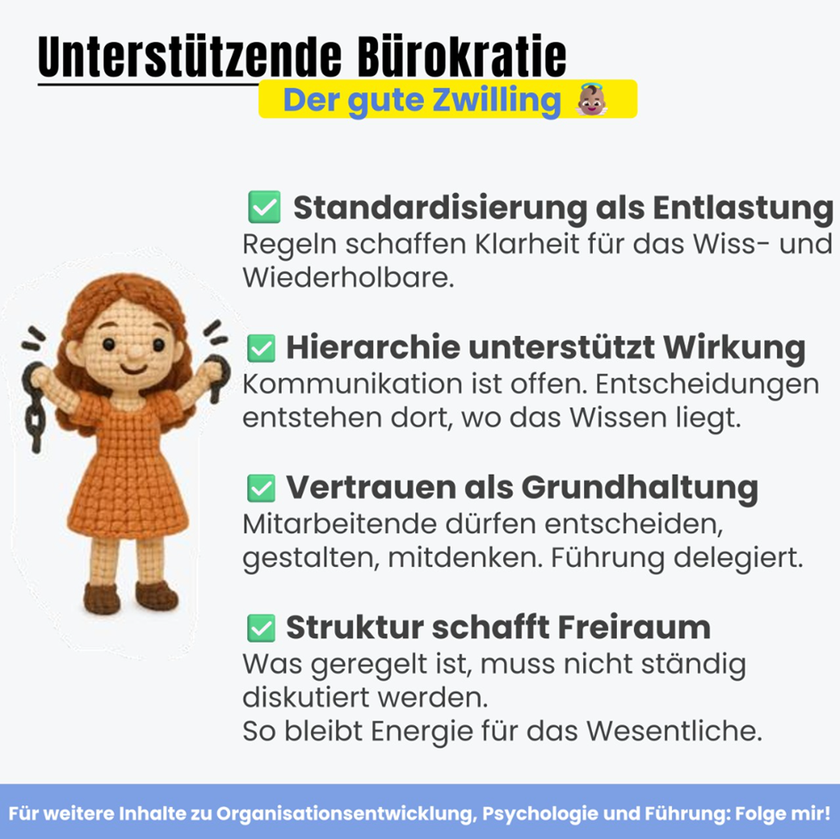
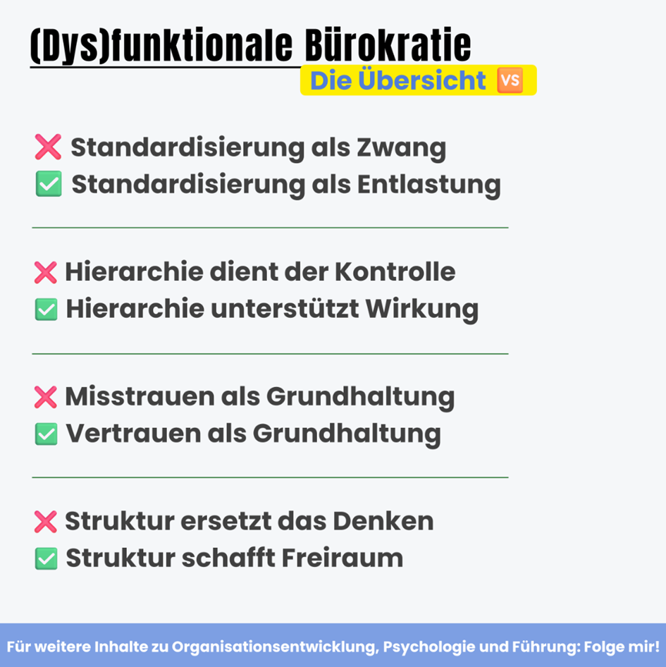
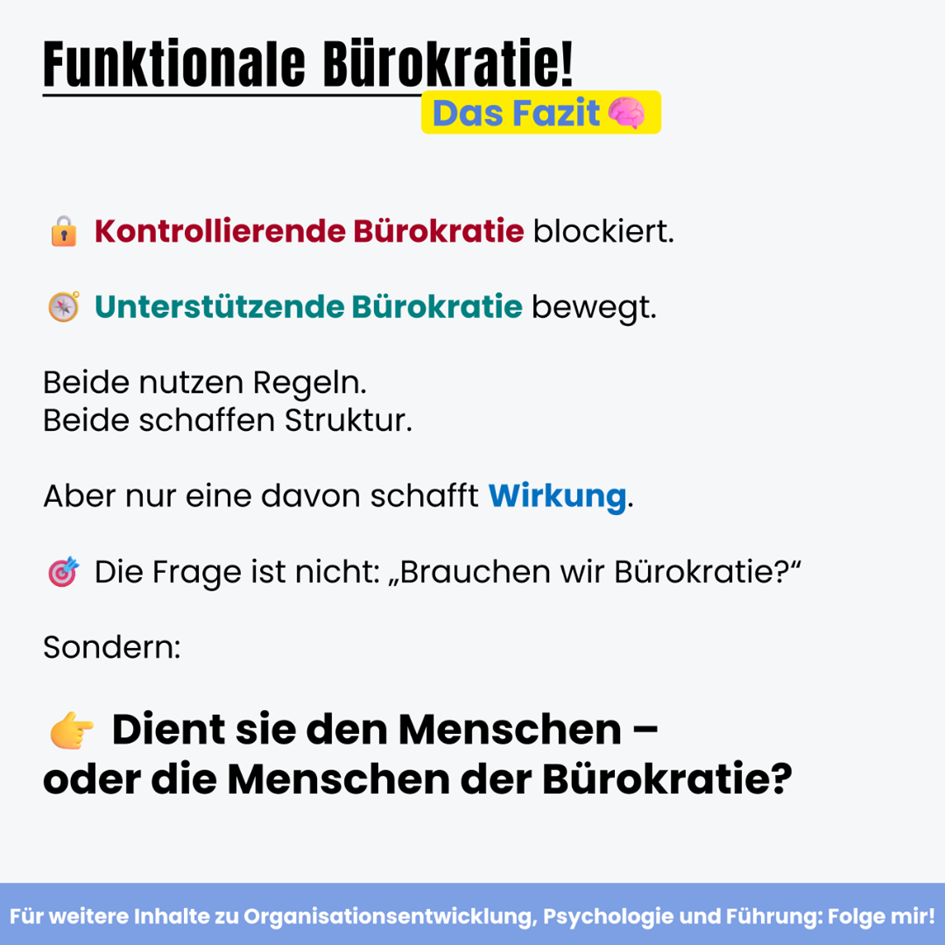

Lass mich raten: Du hast dieses Jahr schon einige Dinge nicht umsetzen können, weil dir Bürokratie Knüppel zwischen die Beine geworfen hat.  
  
Aber Bürokratie an sich ist nicht das Problem.  
  
Sondern wenn sie Menschen ausbremst statt unterstützt.  
  
Wie viele andere auch, habe ich erlebt, wie Struktur zur Sackgasse wird:  
  
🪨 Prozesse, die niemand hinterfragt.  
🪨 Entscheidungen, die im Abstimmungsloop hängen.  
🪨 Verantwortung, die so oft geteilt wird, dass sie am Ende keiner mehr trägt.  
  
Wichtig ist daher zu unterscheiden zwischen kontrollierender Bürokratie (coercive bureaucracy) und befähigender, unterstützender Bürokratie (enabling bureaucracy).  
  
𝗞𝗼𝗻𝘁𝗿𝗼𝗹𝗹𝗶𝗲𝗿𝗲𝗻𝗱𝗲 𝗕ü𝗿𝗼𝗸𝗿𝗮𝘁𝗶𝗲 funktioniert nach dem Prinzip:  
Fehler vermeiden. Kontrolle sichern. Entscheidungen zentralisieren.  
𝘋𝘢𝘴 𝘙𝘦𝘴𝘶𝘭𝘵𝘢𝘵?  
Tempo raus. Verantwortung weg. Motivation runter.  
  
  
Es geht aber auch anders:  
  
Durch 𝘂𝗻𝘁𝗲𝗿𝘀𝘁ü𝘁𝘇𝗲𝗻𝗱𝗲 𝗕ü𝗿𝗼𝗸𝗿𝗮𝘁𝗶𝗲. ✨  
  
Diese stellt nicht Kontrolle ins Zentrum, sondern Wirkung.  
  
Sie fragt nicht: „Wer darf das entscheiden?“  
Sondern: „Wer ist nah genug dran, um es gut zu entscheiden?“  
  
Sie schafft:  
✅ Klar definierte Standards – für das, was wiederholbar ist.  
✅ Entscheidungsfreiheit – für das, was individuell gelöst werden muss.  
✅ Vertrauen – als Betriebssystem für echte Verantwortung.  
  
Organisationen wie 𝗧𝗼𝘆𝗼𝘁𝗮 leben das vor:  
Hoch standardisiert, aber nicht zur Steuerung, sondern als Sprungbrett für kontinuierliche Verbesserung.  
  
Der Clou:  
Routine wird geregelt, damit Energie für das bleibt, was nicht regelbar ist:  
𝗞𝗿𝗲𝗮𝘁𝗶𝘃𝗶𝘁ä𝘁. 𝗜𝗻𝗻𝗼𝘃𝗮𝘁𝗶𝗼𝗻. 𝗠𝗲𝗻𝘀𝗰𝗵𝗹𝗶𝗰𝗵𝗲 𝗜𝗻𝘁𝗲𝗹𝗹𝗶𝗴𝗲𝗻𝘇. 🧠  
  
  
𝘋𝘳𝘦𝘪 𝘍𝘳𝘢𝘨𝘦𝘯 𝘧ü𝘳 𝘥𝘦𝘯 𝘞𝘢𝘯𝘥𝘦𝘭:  
💠 Welche Entscheidungen könnt ihr heute schon dezentral treffen, wenn das Vertrauen da wäre?  
💠Welche Prozesse kosten mehr Energie, als sie bringen?  
💠Welche Standards braucht ihr wirklich – und wo reichen Prinzipien statt Regeln?  
  
  
𝗙𝗮𝘇𝗶𝘁:  
Wir brauchen keine 𝘙𝘦𝘷𝘰𝘭𝘶𝘵𝘪𝘰𝘯 𝘨𝘦𝘨𝘦𝘯 Bürokratie. Wir brauchen eine 𝘛𝘳𝘢𝘯𝘴𝘧𝘰𝘳𝘮𝘢𝘵𝘪𝘰𝘯 𝘷𝘰𝘯 Bürokratie.  
  
Weg von Systemen, die sich selbst verwalten.  
Hin zu Strukturen, die Menschen wirksam machen.  
  
🙋‍♀️💬 Lass es mich wissen: Was war deine letzte Situation, wo du dich über überbordende Bürokratie geärgert hast? Und wo hast du sie bereits sinnvoll eingesetzt gesehen?

